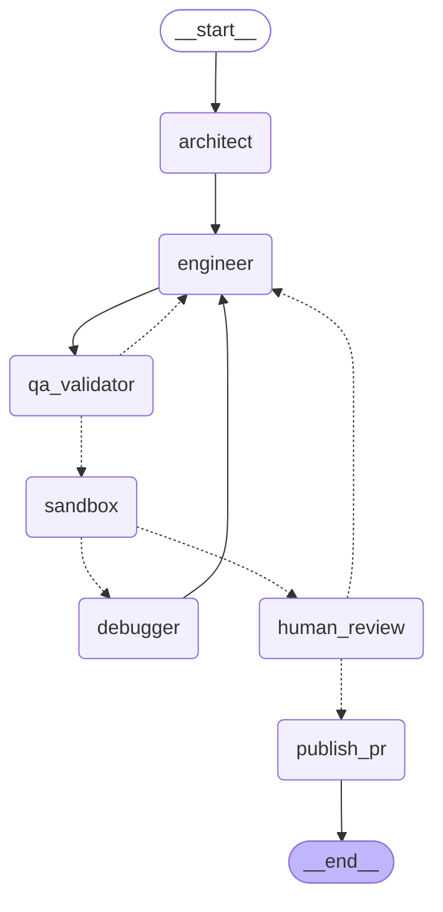

# Repograte

An autonomous migration agent that takes a single file, plans a refactor, writes it,
verifies it in a real sandboxed environment, self-corrects on failure, and stops for
a human before anything gets pushed.

Scoped MVP: **migrating React class components to functional components with hooks.**
The architecture underneath is not specific to that migration - swapping the
Architect/Engineer prompts and the sandbox's verification command targets a
different mechanical migration entirely.

## How it works



| Node             | Model                      | Job                                                                                                                                                                                        |
| ---------------- | -------------------------- | ------------------------------------------------------------------------------------------------------------------------------------------------------------------------------------------ |
| **architect**    | Claude                     | Reads the file, writes a migration plan                                                                                                                                                    |
| **engineer**     | Claude (structured output) | Turns the plan into `search_block` / `replace_block` diffs - never rewrites the whole file                                                                                                 |
| **qa_validator** | DeepSeek + plain code      | A deterministic check confirms every `search_block` exists verbatim in the source (no LLM call needed for that part); DeepSeek then judges only whether the replacement is logically sound |
| **sandbox**      | E2B microVM                | Clones the real repo, applies the diff, runs `npm install` + `tsc --noEmit` (configurable)                                                                                                 |
| **debugger**     | Claude                     | Condenses raw sandbox failure logs into a focused instruction for the next `engineer` attempt, so retries don't re-forward megabytes of npm/tsc output                                     |
| **human_review** | —                          | Pauses the graph for real (`interrupt()`) and waits for a person to approve, reject-with-feedback, or let a WIP through                                                                    |
| **publish_pr**   | —                          | Branches, commits, pushes, opens the PR (draft + `[WIP]` + failure summary if the loop never converged)                                                                                    |

If `sandbox` fails, it loops back through `debugger` → `engineer` → `qa_validator` → `sandbox`
again. After **4** failed loops it stops retrying and opens a **draft PR** with a markdown
summary of every attempt instead of trying forever.

## Project layout

```
repograte/
├── .env.example
├── requirements.txt
├── run_cli.py                    # CLI entry point with the human-approval loop
└── src/
    └── repograte/
        ├── config.py              # centralized env config (pydantic-settings)
        ├── ingestion/             # AST parsing & vector indexing
        │   ├── ast_parser.py      #   tree-sitter TSX parser -> ASTComponent/ASTMethod
        │   └── vector_store.py    #   Qdrant + FastEmbed indexer for RAG-style context
        ├── orchestration/         # The LangGraph state machine
        │   ├── schemas.py         #   Pydantic I/O contracts (diffs, QA results)
        │   ├── state.py           #   the shared graph state (TypedDict)
        │   ├── nodes.py           # Architect/Engineer/QA/Sandbox/Debugger/Review/Publish
        │   └── graph.py           #   wires the nodes + routing + checkpointer together
        ├── sandbox/               # Isolated execution
        │   └── e2b_runner.py      #   boots a microVM, clones the repo, runs verification
        └── vcs/                   # Version control
            └── github_utils.py    #   branch, commit, push, open PR
```

## Requirements

- Python 3.12+
- [uv](https://docs.astral.sh/uv/)
- API keys: **Anthropic**, **DeepSeek**, **E2B**. **GitHub** token only if you want it to
  actually push branches and open PRs (it'll get partway there and raise a clear error
  without one).

## Setup

```bash
git clone <this-repo> && cd repo-pilot

uv venv
source .venv/bin/activate        # Windows: .venv\Scripts\activate

uv pip install -r requirements.txt

cp .env.example .env
# then fill in ANTHROPIC_API_KEY, DEEPSEEK_API_KEY, E2B_API_KEY, GITHUB_TOKEN
```

Prefer not to activate the venv by hand? `uv run` works too, e.g.
`uv run python run_cli.py --help`.

## Running it

```bash
python run_cli.py \
  --repo-url https://github.com/your-org/your-repo.git \
  --file src/components/UserProfile.tsx \
  --code-file ./local-copy/UserProfile.tsx \
  --branch main
```

The graph runs architect → engineer → qa → sandbox on its own. As soon as it reaches
`human_review`, it pauses for real (this is a genuine LangGraph `interrupt()`, not a
sleep loop) and the CLI prints the diff:

```
=== Human review requested ===
File:   src/components/UserProfile.tsx
Status: success  (loop 1)

Reasoning:
Convert the class component to a function component using useState for local state...

Proposed changes:
--- search ---
class UserProfile extends React.Component {
--- replace ---
function UserProfile(props) {

Approve and open PR? [y/n]:
```

Answer `y` to open the PR, or `n` to give feedback and let it try again. Each run is
keyed by `f"{repo_url}:{file_path}"` as the checkpoint thread ID, so re-running the same
command resumes an interrupted run instead of starting over.

## Configuration reference

Everything is read centrally in `config.py` from environment variables (or a `.env`
file at the repo root):

| Variable              | Default                       | Notes                                                                                                                     |
| --------------------- | ----------------------------- | ------------------------------------------------------------------------------------------------------------------------- |
| `ANTHROPIC_API_KEY`   | —                             | Architect / Engineer / Debugger                                                                                           |
| `DEEPSEEK_API_KEY`    | —                             | QA validation                                                                                                             |
| `DEEPSEEK_BASE_URL`   | `https://api.deepseek.com/v1` |                                                                                                                           |
| `E2B_API_KEY`         | —                             | Sandbox execution                                                                                                         |
| `E2B_TEMPLATE`        | `base`                        | Build a custom template (`e2b template build`) with your toolchain preinstalled to cut ~20-30s off every verification run |
| `E2B_TIMEOUT_SECONDS` | `300`                         |                                                                                                                           |
| `GITHUB_TOKEN`        | —                             | Needs push + PR permissions (classic PAT: `repo` scope)                                                                   |
| `QDRANT_URL`          | —                             | Leave blank for a local in-memory instance                                                                                |
| `QDRANT_API_KEY`      | —                             | Only needed for Qdrant Cloud                                                                                              |
