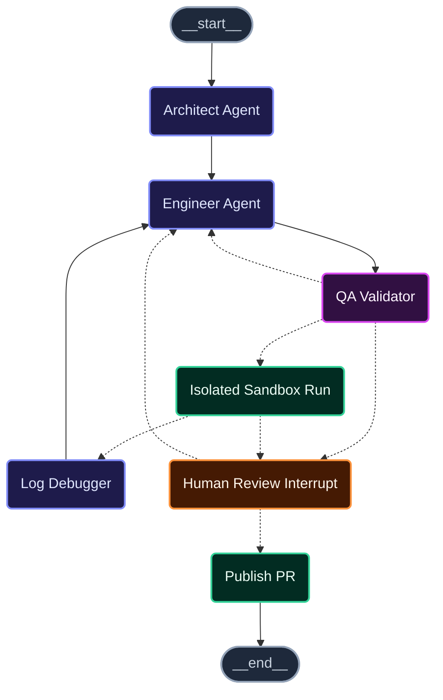

# Repograte

<p align="left">
  
  
  
  
</p>

An autonomous migration agent that takes one file - or an entire repo - plans a refactor, writes it, verifies it in a real sandboxed environment, self-corrects on failure, and stops for a human before anything gets pushed.

Ships with two migrations out of the box: **React class components → hooks**, and **Python 2 → 3**. Both prompts, scope, and sandbox commands live in a small YAML `MigrationSpec` (see [Configurable migrations](#-configurable-migrations)) rather than being hardcoded, so pointing this at a different mechanical migration is a matter of writing a YAML file, not editing Python. It isn't limited to TypeScript or Python either: file parsing goes through a small language-adapter registry (TSX/JSX/TS/JS, Python, or a generic text fallback for anything else - see [Configuration reference](#%EF%B8%8F-configuration-reference)).

For a whole codebase at once, `run_codebase_cli.py` scans the repo, works out a sensible file order (files other migrated files depend on go first), and runs the same single-file pipeline below once per file - batching every approved change into **one PR** at the end. See [Migrating a whole codebase](#%EF%B8%8F-migrating-a-whole-codebase).

---

## 🚀 How it works

This is the graph for **one file** - a codebase-wide run (`run_codebase_cli.py`) executes
this exact graph once per file, in dependency order, and only opens a PR once every file
has gone through it. See [Migrating a whole codebase](#%EF%B8%8F-migrating-a-whole-codebase).



| Node             | Model                      | Job                                                                                                                                                                                                                                                                                                                                                                                                          |
| ---------------- | -------------------------- | ------------------------------------------------------------------------------------------------------------------------------------------------------------------------------------------------------------------------------------------------------------------------------------------------------------------------------------------------------------------------------------------------------------ |
| **architect**    | Claude                     | Reads the file, writes a migration plan using the active `MigrationSpec`'s prompt. Best-effort, feature-flagged: also clones the repo, finds sibling components already written in it (or already migrated earlier in this same run - see [Migrating a whole codebase](#%EF%B8%8F-migrating-a-whole-codebase)), and hands the Architect a couple of relevant examples for consistency (`ENABLE_RAG_CONTEXT`) |
| **engineer**     | Claude (structured output) | Turns the plan (or the last failure's feedback) into `search_block` / `replace_block` diffs - never rewrites the whole file                                                                                                                                                                                                                                                                                  |
| **qa_validator** | DeepSeek + plain code      | A deterministic check confirms every `search_block` exists verbatim and none overlap (no LLM call needed for that part); DeepSeek then judges only whether the replacement is logically sound                                                                                                                                                                                                                |
| **sandbox**      | E2B microVM                | Clones the real repo, applies the diff, runs the spec's install/test commands (default spec: `npm install` + `tsc --noEmit`, override via env vars or `--install-cmd`/`--test-cmd`)                                                                                                                                                                                                                          |
| **debugger**     | Claude                     | Condenses raw sandbox failure logs into a focused instruction for the next `engineer` attempt, so retries don't re-forward megabytes of npm/tsc output                                                                                                                                                                                                                                                       |
| **human_review** | —                          | Pauses the graph for real (`interrupt()`) and waits for a person to approve, reject-with-feedback, or let a WIP through. Sees the Architect's full plan, not just the Engineer's one-line reasoning                                                                                                                                                                                                          |
| **publish_pr**   | —                          | Branches, commits, pushes, opens the PR (draft + `[WIP]` + failure summary if the loop never converged) - or, in a codebase-wide run, just hands the patch back to the driver instead of publishing per-file                                                                                                                                                                                                 |

If `sandbox` **or** `qa_validator` keeps failing, the run loops (`engineer` → `qa_validator`
→ `sandbox` → `debugger` → `engineer` ...) until it either succeeds or hits
`MAX_CORRECTION_LOOPS` (default **4**) - whichever node it fails at. At that point it
stops retrying and opens a **draft PR** with a markdown summary of every attempt
instead of trying forever.

## 📦 Project layout

```
repograte/
├── .env.example
├── .github/workflows/tests.yml   # CI: uv sync + pytest on push/PR
├── .gitignore
├── requirements.txt
├── pyproject.toml                 # deps, build-system, pytest config
├── tests/                         # pytest - pure logic + mocked-external integration tests
└── src/
    ├── run_cli.py                 # single-file CLI, with the human-approval loop
    ├── run_codebase_cli.py        # codebase-wide CLI: scans, orders, drives run_cli's graph per file
    └── repograte/
        ├── config.py              # centralized env config (pydantic-settings)
        ├── migrations/            # built-in MigrationSpecs (prompts + scope + sandbox cmds)
        │   ├── react_class_to_hooks.yaml
        │   └── python2_to_3.yaml
        ├── ingestion/             # AST parsing & vector indexing
        │   ├── ast_parser.py      #   tree-sitter TSX/JSX/TS/JS parser -> ASTComponent/ASTMethod
        │   ├── python_parser.py   #   tree-sitter Python parser (same ASTComponent/ASTMethod shape)
        │   ├── languages.py       #   adapter registry + generic text fallback for any other extension
        │   ├── vector_store.py    #   Qdrant + FastEmbed indexer (stable per-component IDs -> safe upserts)
        │   └── context.py         #   clones the repo, indexes sibling components, retrieves matches for the Architect
        ├── orchestration/         # The LangGraph state machine
        │   ├── schemas.py         #   Pydantic I/O contracts (diffs, QA results)
        │   ├── state.py           #   the shared graph state (TypedDict)
        │   ├── migration_spec.py  #   MigrationSpec model + YAML loader
        │   ├── diffing.py         #   applies search/replace blocks (pure, unit-tested)
        │   ├── routing.py         #   conditional-edge logic (pure, unit-tested)
        │   ├── nodes.py           #   Architect/Engineer/QA/Sandbox/Debugger/Review/Publish
        │   ├── graph.py           #   wires the nodes + routing + checkpointer together (one file)
        │   └── codebase.py        #   discovery, dependency ordering, and the per-file driver (whole repo)
        ├── sandbox/               # Isolated execution
        │   └── e2b_runner.py      #   boots a microVM, clones the repo, runs verification
        └── vcs/                   # Version control
            └── github_utils.py    #   branch, commit, push, open a (possibly multi-file) PR
```

## Requirements

- Python 3.12+
- [uv](https://docs.astral.sh/uv/) (or plain `pip` + `requirements.txt`)
- API keys: **Anthropic**, **DeepSeek**, **E2B**. **GitHub** token only if you want it to
  actually push branches and open PRs - without one, `create_pull_request` raises
  immediately, before touching git, rather than getting partway through a clone/commit
  and failing on push.

## 🛠️ Setup

```bash
git clone <this-repo> && cd Repograte

uv venv
source .venv/bin/activate        # Windows: .venv\Scripts\activate

uv sync                          # or: uv pip install -r requirements.txt

cp .env.example .env
# then fill in ANTHROPIC_API_KEY, DEEPSEEK_API_KEY, E2B_API_KEY, GITHUB_TOKEN
```

Prefer not to activate the venv by hand? `uv run` works too, e.g.
`uv run python src/run_cli.py --help`.

## 💻 Running it

```bash
cd src
python run_cli.py \
  --repo-url https://github.com/your-org/your-repo.git \
  --file src/components/UserProfile.tsx \
  --code-file ./local-copy/UserProfile.tsx \
  --branch main
```

For a non-TypeScript repo, override the verification command for this run only:

```bash
python run_cli.py \
  --repo-url https://github.com/your-org/your-repo.git \
  --file src/components/UserProfile.jsx \
  --code-file ./local-copy/UserProfile.jsx \
  --test-cmd "npm run lint"
```

Or point it at a completely different migration - built in or your own YAML file (see
[Configurable migrations](#-configurable-migrations)):

```bash
python run_cli.py \
  --repo-url https://github.com/your-org/your-repo.git \
  --file legacy/worker.py \
  --code-file ./local-copy/worker.py \
  --migration python2-to-3
```

The graph runs architect → engineer → qa → sandbox on its own. As soon as it reaches
`human_review`, it pauses for real (this is a genuine LangGraph `interrupt()`, not a
sleep loop) and the CLI prints the plan and diff:

```diff
=== Human review requested ===
File:   src/components/UserProfile.tsx
Status: success  (loop 1)

Architect plan:
1. Replace the class declaration with a function component.
2. Convert this.state to a useState hook...

Reasoning:
Convert the class component to a function component using useState for local state...

Proposed changes:
--- search ---
class UserProfile extends React.Component {
--- replace ---
function UserProfile(props) {

Approve and open PR? [y/n]:
```

Answer `y` to open the PR, or `n` to give feedback and let it try again. Each run is
keyed by `f"{repo_url}:{file_path}"` as the checkpoint thread ID. By default
(`CHECKPOINT_PATH` set) this is backed by a local SQLite file, so **re-running the
exact same command later genuinely resumes an interrupted run** - including if you
killed the CLI process entirely - instead of silently starting over. Set
`CHECKPOINT_PATH=` (empty) to fall back to a pure in-memory checkpointer instead.

## 🗂️ Migrating a whole codebase

```bash
cd src
python run_codebase_cli.py \
  --repo-url https://github.com/your-org/your-repo.git \
  --branch main \
  --migration react-class-to-hooks
```

This clones the repo, finds every file the spec applies to that actually contains a
migratable component, and prints the order it'll process them in - files that other
target files locally import go first, so by the time a file is migrated, anything it
depends on (that's also being migrated) already has been:

```
Scanning https://github.com/your-org/your-repo.git for files matching 'react-class-to-hooks' ...
Found 3 file(s), migrating in this order:
  - src/components/Avatar.tsx
  - src/components/UserCard.tsx
  - src/pages/ProfilePage.tsx
```

Each file then runs through the exact same graph as the single-file CLI - architect,
engineer, QA, sandbox, human review - one at a time. Three things differ from running
each file separately, though:

- **Sandbox verification is cumulative.** File 2's check runs against a working tree
  that already has file 1's _approved_ patch applied, not the pristine original - so
  breakage between two migrated files gets caught, not just breakage within one file.
- **Architect context is cumulative too** (when `ENABLE_RAG_CONTEXT` is on): by the
  time it plans file 3, it can see files 1 and 2 in their _migrated_ form.
- **One PR at the end**, not one per file - covering everything that converged or hit
  the retry cap (marked `[WIP]` in the PR body), whichever came first for each file.

At each file's human-review pause you get a third option beyond approve/retry:
`[s]kip this file` - drop it from this run's batch entirely (its own progress isn't
destroyed; re-running later will ask about it again).

For a large repo, `--auto-approve` skips the manual prompt for any file that passes
QA + sandbox cleanly - anything that hits the retry cap still stops for a human, since
that's the entire point of the cap:

```bash
python run_codebase_cli.py \
  --repo-url https://github.com/your-org/your-repo.git \
  --migration react-class-to-hooks \
  --auto-approve \
  --max-files 50
```

Killed the process partway through a large run? Just re-run the same command. Each
file has its own checkpoint thread exactly like the single-file CLI, so anything
already fully approved is reused instead of re-migrated, and anything mid-flight
resumes where it paused. The file _list itself_ is re-discovered fresh each time
(cheap - one clone, no LLM calls), so a file removed from the repo since your last
attempt simply won't be in the new list.

## 🧩 Configurable migrations

Every prompt (Architect/Engineer/QA/Debugger), which files a migration targets, which
language adapter parses them for context, and the sandbox's install/test commands live
in one `MigrationSpec` - a YAML file, not Python source. Two ship built in:

| Name                   | Targets             | Language adapter | Sandbox check                   |
| ---------------------- | ------------------- | ---------------- | ------------------------------- |
| `react-class-to-hooks` | `.tsx/.jsx/.ts/.js` | `tsx`            | `npm install` + `tsc --noEmit`  |
| `python2-to-3`         | `.py`               | `python`         | `python3 -m py_compile {files}` |

`{files}` in a `sandbox_test_cmd` is substituted with the space-joined paths actually
written that round - useful for a command like `py_compile` that needs to be told
which files to check, unlike `tsc`, which scans a whole project via `tsconfig.json`
regardless of which files changed.

Point `--migration` at a path to your own YAML file for anything else:

```yaml
name: my-migration
description: Whatever you're migrating
file_extensions: ['.rb']
language_adapter: generic # "tsx" | "python" | "generic" - see ingestion/languages.py
architect_prompt: 'You are ...'
engineer_prompt: 'You are ...'
qa_prompt: 'You are ...'
debugger_prompt: 'You are ...'
sandbox_install_cmd: 'bundle install'
sandbox_test_cmd: 'ruby -c {files}'
```

`language_adapter: generic` means context retrieval still works (the whole file
becomes one pseudo-component) - it's just not broken down into individual
methods/functions the way TSX and Python are. Adding real structural parsing for a
third language is a matter of implementing one class with a
`parse_file(path, content) -> list[ASTComponent]` method and registering it in
`ingestion/languages.py` - nothing in the orchestration layer needs to change.

## 🧪 Testing

```bash
uv sync --group dev
uv run pytest -v
```

The suite covers the pure orchestration logic (diff application, routing, dependency
ordering, the loop-cap fix), both language adapters, the migration-spec loader,
GitHub URL/PR-body helpers, the E2B command-templating logic, and full graph runs -
Claude, DeepSeek, E2B, and GitHub all replaced with fakes - for both a single file and
a multi-file codebase-wide run, including regression tests for cross-process resume at
both levels and for the same graph running an entirely different `MigrationSpec`
end to end. It does **not** exercise the live LLM/sandbox/GitHub calls or the FastEmbed
embedding step (the latter needs to download a model from Hugging Face on first use -
set `ENABLE_RAG_CONTEXT=false` if that egress isn't available to you, e.g. in a
locked-down CI runner).

## ⚙️ Configuration reference

Everything is read centrally in `config.py` from environment variables (or a `.env`
file at the repo root):

<details>
<summary><b>Click to expand full Environment Variable matrix</b></summary>

| Variable               | Default                            | Notes                                                                                                                                |
| ---------------------- | ---------------------------------- | ------------------------------------------------------------------------------------------------------------------------------------ |
| `ANTHROPIC_API_KEY`    | —                                  | Architect / Engineer / Debugger                                                                                                      |
| `ANTHROPIC_MODEL`      | `claude-sonnet-5`                  | Must be a real model id                                                                                                              |
| `DEEPSEEK_API_KEY`     | —                                  | QA validation                                                                                                                        |
| `DEEPSEEK_BASE_URL`    | `https://api.deepseek.com/v1`      |                                                                                                                                      |
| `E2B_API_KEY`          | —                                  | Sandbox execution                                                                                                                    |
| `E2B_TEMPLATE`         | `base`                             | Build a custom template (`e2b template build`) with your toolchain preinstalled to cut ~20-30s off every verification run            |
| `E2B_TIMEOUT_SECONDS`  | `300`                              |                                                                                                                                      |
| `SANDBOX_INSTALL_CMD`  | `npm install --no-audit --no-fund` | Per-run override: `--install-cmd`                                                                                                    |
| `SANDBOX_TEST_CMD`     | `npx tsc --noEmit`                 | Per-run override: `--test-cmd`. Use this for JS-only / non-tsc projects                                                              |
| `GITHUB_TOKEN`         | —                                  | Needs push + PR permissions (classic PAT: `repo` scope)                                                                              |
| `QDRANT_URL`           | —                                  | Leave blank for a throwaway local in-memory instance                                                                                 |
| `QDRANT_API_KEY`       | —                                  | Only needed for Qdrant Cloud                                                                                                         |
| `ENABLE_RAG_CONTEXT`   | `true`                             | Set `false` to skip the sibling-component retrieval step entirely (offline/CI use)                                                   |
| `RAG_MAX_FILES`        | `40`                               | Cap on how many files the context-retrieval step will parse per run                                                                  |
| `MAX_CORRECTION_LOOPS` | `4`                                | Applies to both the QA-validation loop and the sandbox-verification loop                                                             |
| `CHECKPOINT_PATH`      | `.repograte/checkpoints.sqlite`    | Set to an empty string for a pure in-memory checkpointer (no cross-process resume)                                                   |
| `DEFAULT_MIGRATION`    | `react-class-to-hooks`             | Default for `--migration` on both CLIs                                                                                               |
| `CODEBASE_MAX_FILES`   | `100`                              | Hard cap on how many files one codebase-wide run will touch, independent of `RAG_MAX_FILES` (context retrieval, not migration scope) |

</details>

## ⚠️ Current Architecture & Considerations

- **Execution Isolation**: RAG context generation and PR publishing currently clone isolated working copies. This ensures strict separation of concerns for the MVP, though future updates will introduce shared workspaces to optimize cloning overhead for larger repositories.

- **Vector State Management**: Component updates are safely upserted without duplication via deterministic hashing (implemented in b296dfd). Note that if utilizing a persistent Qdrant Cloud collection, deleted or renamed files will currently leave orphaned vectors, which requires manual cleanup.

- **Dependency Resolution**: Codebase-wide runs utilize a best-effort heuristic for processing order. It effectively resolves relative imports and breaks circular dependencies alphabetically, though strict dependency-aware processing is not yet guaranteed.

- **Fault Tolerance**: Migration progress is safely checkpointed at the individual file level. If a global run is interrupted, the system leverages a lightweight re-discovery of the file tree upon restart. Currently, this means any previously "skipped" files will prompt the user again during recovery.
